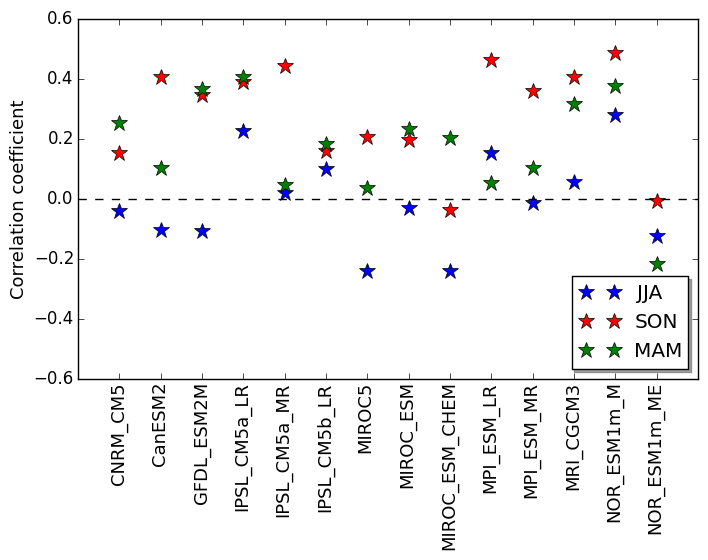
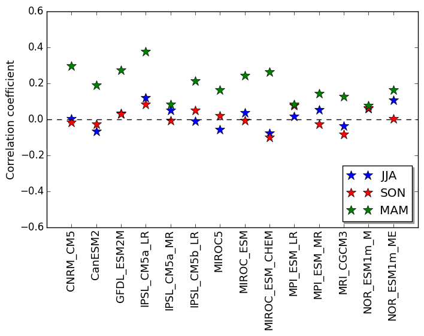

# June 30, 2015

Yesterday: Completed figures for seasonal SAM analysis including: 
* DJF-JJA Joint Probabilities (now with same colorbar axes). 
* DJF-JJA Scatter Plots with correlation values
* Correlation of DJF with other seasons (JJA, SON, MAM) for SAM TRENDS
* Correlation of DJF with other seasons for SAM (i.e. climatologies). 

Joint Probabilities show little relationship between trends in DJF and trends in JJA. Theoretically, we would expect in years with strong trends in DJF, there would also be strong trends in JJA (i.e. the cloud would fall along a diagonal). 
The density clouds however are roughly circulat with a few exceptions: 
* IPSL CM5b LR has strong DJF trends and low JJA trends. 
* MIROC5 has strong JJA trends and low DJF trends. This is interesting since MIROC5 is one of the only models where the observed SAM trend is outside natural variability. 
* NOR ESM1m ME also has strong JJA trends and low DJF trends. 

Scatter plots show very little correlation between DJF and JJA Trends, with a R-squared value of approximately 0.05. 

There seems to be no correlation pattern between DJF SAM trends and any of the other seasons consistent across various models.
This is different from the SAM DJF climatplogies correlated with other seasons, where the strongest correlation is between DJF and MAM. Correlation between DJF and JJA/SON are very similar.  

